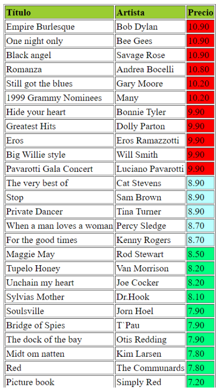
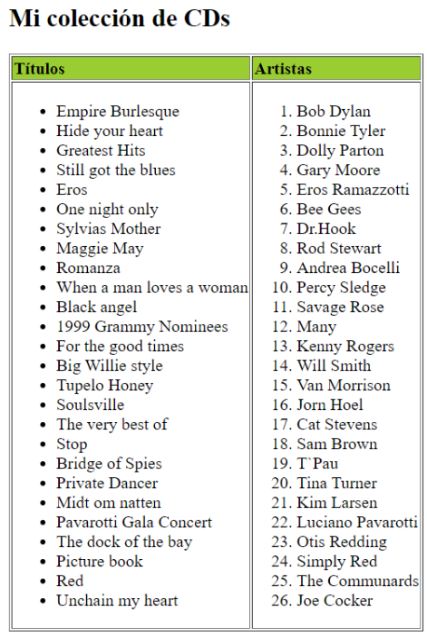

# Colección de CDs

Dos plantillas html con dos tipos de salidas completamente diferentes.

Debes realizar dos XSL distintas, una para cada tipo de salida.

En la carpeta de recursos tendrás todo lo necesario para realizarlo.

## Con formato tabla: el precio se muestra en orden descendente y de distintos colores según el precio (menor o igual a 8,5 y mayor de 9)

## Con formato lista dentro de una tabla

