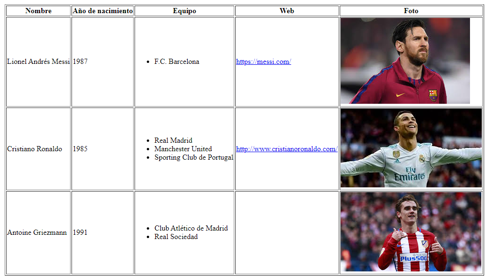

# Jugadores de fútbol

A partir del documento XML jugadores.xml, debes diseñar la hoja de estilo XSL para que una vez realizada la 

transformación XSLT se genere la siguiente página HTML:

En la carpeta de recursos tendrás todo lo necesario para realizarlo.